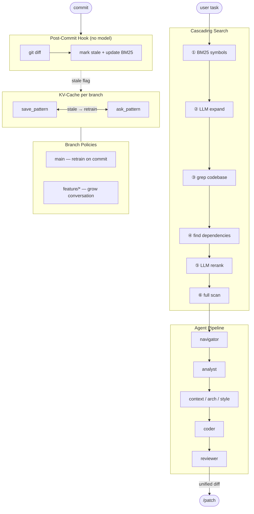

# Cognit — Persistent Neural Context

[🇷🇺 Русская версия](README.ru.md)

A local AI assistant for codebases. One model (Qwen2.5-Coder-7B), everything in-process, no API keys required.



---

## 1. Core Ideas

### 1.1. Pipeline with Context Distillation

The main problem with small models is limited context. Qwen2.5-Coder-7B can only see ~8000 tokens at a time. If you feed it a file + all style conventions + architecture + the task — the context overflows and there's no room left for a response.

Cognit solves this with a **sequential pipeline**: each agent in a separate eval pass receives the file + its own knowledge and compresses it into a short memo (2-4 sentences). The coder at the end receives the file + focused memos instead of all the original documents:

```
Task: "fix the bayes_update function"
  │
  ├─ [1] Navigator        → "bayes_update() lines 42-67, depends on validate_input()"
  │
  ├─ [2] analyst          → "replace X with Y at line 45, add validation to Z"
  │       (analyzes code + task → specific plan)
  │
  ├─ [3] context agent    → "project goal — demo of Bayesian methods"
  │       (knowledge from agents/context/)
  │
  ├─ [4] arch agent       → "don't break the float→float signature, dependencies X→Y"
  │       (knowledge from agents/arch/)
  │
  ├─ [5] style agent      → "snake_case, type hints required, docstring"
  │       (knowledge from agents/style/)
  │
  ├─ [6] coder            → unified diff following analyst's plan + agent constraints
  │
  └─ [7] reviewer         → validates diff against code structure, removes duplicates
              │
              ▼
           /patch → file updated
```

**Context arithmetic:**

```
Without pipeline:  file 3000 + style.md 800 + arch.md 600 + context.md 500 + task 50 = 4950 tokens
                   Left for response: ~3200 tokens — barely enough for a diff

With pipeline:     analyst:       [file 3000 + task 50]                  → memo 80 tokens
                   style agent:   [file 3000 + style.md 800 + task 50]   → memo 80 tokens
                   arch agent:    [file 3000 + arch.md 600 + task 50]    → memo 80 tokens
                   context agent: [file 3000 + context.md 500 + task 50] → memo 80 tokens
                   coder:         [file 3000 + 4 memos 320 + task 50]    = 3370 tokens
                   Left for response: ~4800 tokens — plenty of room for a diff
```

Each agent runs in its own eval and sees the full context of its knowledge. The coder receives the same knowledge, but **compressed into memos** — leaving more room for code generation.

**How it works technically:** each stage is a full eval from scratch. The agent text + all accumulated shared context is saved as a temporary pattern, the question is asked, the memo is added to the shared context, and the temporary pattern is deleted. The next stage sees everything that previous stages have accumulated.

KV-cache continuation (appending tokens to an existing cache) is unreliable for large text blocks — the model breaks on injections exceeding ~700 tokens. Therefore each stage does a full eval — slower, but stable.

Agents draw knowledge from `agents/` — markdown files in the client project's git repository. This is the team's knowledge base: style conventions, architectural decisions, project context. The pipeline is configured via `pipeline.json` — you can change the order, disable stages, or add custom agents.

### 1.2. KV-cache — Speeding Up Repeated Queries

The pipeline re-reads files from scratch every time — reliable, but slow. For **manual mode** (when you're working with a single file and asking questions) Cognit saves the model's KV-cache to disk:

```
/load auth @src/auth.py         → eval file (~15 sec) → auth.pkl saved
use auth → question              → load_state (~1 sec) → response
```

This doesn't extend the context — the file still needs to fit within 8192 tokens. But it saves time on repeated queries to the same file.

### 1.3. Branches and Knowledge Accumulation

Saved states (patterns) are tied to the git branch. Switch to a different branch — Cognit automatically uses its patterns.

```
echo_patterns/my-project/
  main/            ← recreated on each commit (retrain)
  feature-login/   ← conversation accumulates between sessions (grow)
```

In feature branches, each question is appended to the KV-cache — the model remembers the entire conversation history. A **lightweight post-commit hook** (`cognit_hook.py`) detects changed files without loading the model — it marks affected patterns as stale and incrementally updates the BM25 index. Stale patterns are lazily retrained on next `/ask`.

---

## 2. Supporting Technologies

### Tree-sitter — Code Navigation

When a user describes a task, Cognit needs to find the relevant files. For this it uses [tree-sitter](https://tree-sitter.github.io/) — a parser that builds an AST (Abstract Syntax Tree) for each Python file in the project.

**Symbols** are extracted from the AST: function names, classes, methods, imports — along with line numbers, signatures, and docstrings. This creates a structural map of the project without needing to read all the code.

### Cascading Search — From BM25 to Full Scan

Finding the right files is a cascading process — each step only fires if the previous ones didn't find enough:

| Step | Cost | When |
|---|---|---|
| **[1] BM25** over symbols | free, <100ms | always |
| **[2] LLM query expansion** | ~2-3s | BM25 found < 5 results |
| **[3] grep** over codebase | free, <500ms | still < 5 results |
| **[4] find dependencies** (AST) | free, <200ms | enrich found results |
| **[5] LLM rerank** | ~2-3s | > 3 candidates |
| **[6] chunked full scan** | ~30-120s | nothing found (last resort) |

```
Query: "fix data processing"
  [1] BM25           → 0 results (no lexical match)
  [2] LLM expansion  → suggests "process_data, DataHandler, parse_input"
      BM25(expanded)  → 8 results
  [4] dependencies   → +3 callers of process_data()
  [5] LLM rerank     → top-8 by relevance
```

The index is **incremental** — on subsequent runs it skips files with unchanged hashes. The cache is stored in `_code_index.json`. LLM-based steps can be disabled via `"rerank": false` in `.echo.json`.

### ChatML — Model Communication Format

Qwen2.5-Coder uses the ChatML format for role separation. llama-cpp-python does not apply the template automatically, so Cognit wraps each request manually:

```
<|im_start|>user
[text]<|im_end|>
<|im_start|>assistant
```

Critical detail: `llm.tokenize()` is called with `special=True` — without this, special tokens (`<|im_start|>`, `<|im_end|>`) are not recognized and the model cannot understand the dialog structure.

---

## 3. Limitations

**Search is heuristic, not perfect.** The cascading search (BM25 → LLM expansion → grep → dependencies → rerank → full scan) covers most cases, but very abstract queries with no lexical overlap may still require specifying concrete function/class names.

**Model context is limited to 8192 tokens** (~300-400 lines of code). The pipeline truncates files exceeding 8000 characters. For large files, the navigator focuses context on the relevant lines using line numbers from tree-sitter.

**Quality depends on agents/.** If `style/global.md` contains only a template — the style agent won't add value. Agents are only as useful as the conventions described in them.

**Python only.** The tree-sitter navigator parses `.py` files. Other languages require adding the corresponding tree-sitter grammars.

**Patterns are not portable.** KV-cache is tied to a specific model and llama-cpp-python version. A different machine with a different quantization cannot load another machine's patterns.

**One model for everything.** Navigation, agents, coder, reviewer — everything runs on a single model. This is convenient (one process, ~5 GB VRAM), but diff quality is limited by the capabilities of a 7-8B model.

---

## Installation and Setup

```bash
pip install llama-cpp-python --extra-index-url https://abetlen.github.io/llama-cpp-python/whl/cu121
pip install tree-sitter tree-sitter-python
```

Download the model (GGUF) and place it in `models/`:
- **Transformer**: `qwen2.5-coder-7b-instruct-q4_k_m.gguf` (~4.7 GB VRAM)

One-time setup:

```bash
python cognit_setup.py
```

Creates `.echo.json`, `agents/` templates, `pipeline.json`, and installs git hooks.

### Configuration (`.echo.json`)

```json
{
  "backend": "transformer",
  "transformer": {
    "model_path":   "models/Qwen/qwen2.5-coder-7b-instruct-q4_k_m.gguf",
    "n_gpu_layers": -1,
    "n_ctx":        8192,
    "max_tokens":   512
  },
  "client_project": "C:/path/to/your/project"
}
```

---

## Quick Start

### Typical session — task is unknown (pipeline)

```
python cognit.py

🧠> fix the bayes_update function — make it more comprehensive
   📇 Index: 3 files, 12 symbols
   📍 Found 4 symbols in 1 file:
      • main.py  (bayes_update, _read_prob, main)

🚀 Pipeline (7 stages)
  ✓ [nav     ] navigator
  ✓ [agent   ] analyst
  ✓ [agent   ] context
  ✓ [agent   ] arch
  ✓ [agent   ] style
  ✓ [coder   ] coder
  ✓ [reviewer] reviewer
  💡 Diff ready → /patch

🧠 [_pipeline]> /patch
✅ Patch applied → main.py
```

### Typical session — file is known (manual mode)

```
python cognit.py

🧠> /load auth @src/auth.py
🧠 [auth]> are there any bugs in the JWT verification?
🧠 [auth]> /edit @src/auth.py remove hardcoded RS256
💡 Apply? → /patch
🧠 [auth]> /patch
✅ Patch applied → src/auth.py
```

---

## Technical Details

### Pattern Storage

```
echo_patterns/<repo>/<branch>/
  <name>.pkl / .json       ← KV-cache + metadata (model, hashes, source files)
  _pipeline.pkl / .json    ← temporary coder pattern (overwritten each run)
  _pipeline_log_*.md       ← pipeline log (task, agent memos, diff)
  _code_index.json         ← tree-sitter index cache
```

Patterns are tied to the model — `load_pattern` checks quantization compatibility.

| Policy | When | Behavior |
|---|---|---|
| `retrain` | `main`/`master`, `agents/` | Recreated on commit (post-commit hook) |
| `grow ~` | Feature branches | Accumulates conversation between sessions |

### agents/ — Project Knowledge Base

Markdown files in the client project's git repository. Loaded automatically on startup:

```
agents/
  style/global.md      ← naming, formatting, restrictions
  arch/overview.md     ← modules, dependencies, data flow
  context/project.md   ← project goal, business rules
```

**Adding an agent:** create `agents/<name>/global.md` + add a stage to `pipeline.json`:

```json
{"id": "security", "type": "agent", "name": "security", "enabled": true,
 "role": "Task: {task}\n\nWhat are the security risks? Write briefly."}
```

### Code Editing

**`/patch`** — extracts all unified diffs from the last response, resolves paths via `client_project`, creates a `.cognit.bak` before writing.

**`/edit @file task`** — re-reads the file (not from KV-cache) → accurate line numbers → unified diff.

### Structure

```
my-project/              ← client git repo
  agents/                ← knowledge base (in git)
  pipeline.json          ← stage order (in git)

Cognit/                  ← this repository
  cognit.py              ← entry point
  cognit_transformer.py  ← Transformer backend (KV-cache, Qwen)
  cognit_index.py        ← tree-sitter navigator (AST + BM25 + grep + deps)
  cognit_pipeline.py     ← pipeline configuration
  cognit_core.py         ← utilities (git, patterns, hashes, stale detection)
  cognit_hook.py         ← lightweight post-commit hook (no model loading)
  cognit_patch.py        ← unified diff application
  cognit_agents.py       ← agents/ handling
  cognit_i18n.py         ← bilingual messages (EN/RU)
  cognit_setup.py        ← one-time setup
```

---

## Commands

```bash
# Patterns
/load auth @src/auth.py        # load file → pattern
/load repo @src/               # load directory
use auth                       # switch to pattern
/list                          # list patterns

# Questions  [requires active pattern]
how does login work?           # ask — response saved to KV-cache (if grow)
? how does login work?         # peek — response NOT saved

# Code editing
/edit @src/auth.py remove dupes # fresh read → diff
/patch                         # apply all diffs from response
/patch @src/other.py           # apply to specific file

# Navigation
/index                         # project overview (tree-sitter)
/index bayes update            # BM25 symbol search
route add rate limiting        # tree-sitter → pipeline

# Agents  [manual mode]
/agent style arch              # ambient: questions via [pattern + agents]
/agent off                     # disable
/review @src/auth.py           # review via style agent

# Headless
python cognit_transformer.py --status
python cognit_transformer.py --refresh-file src/auth.py
```
